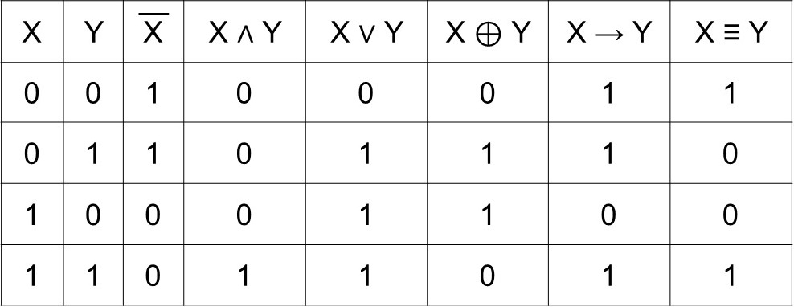
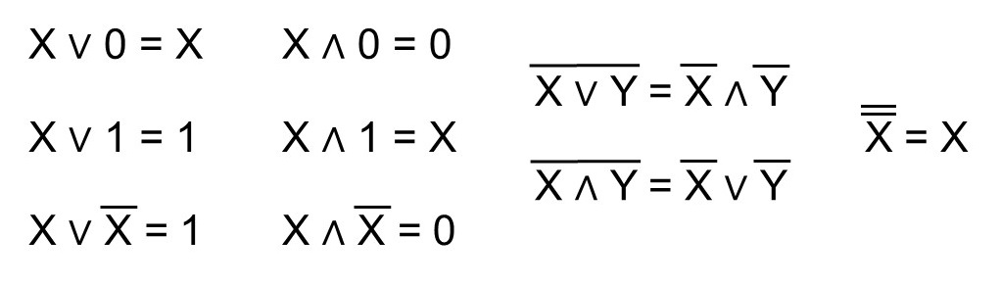
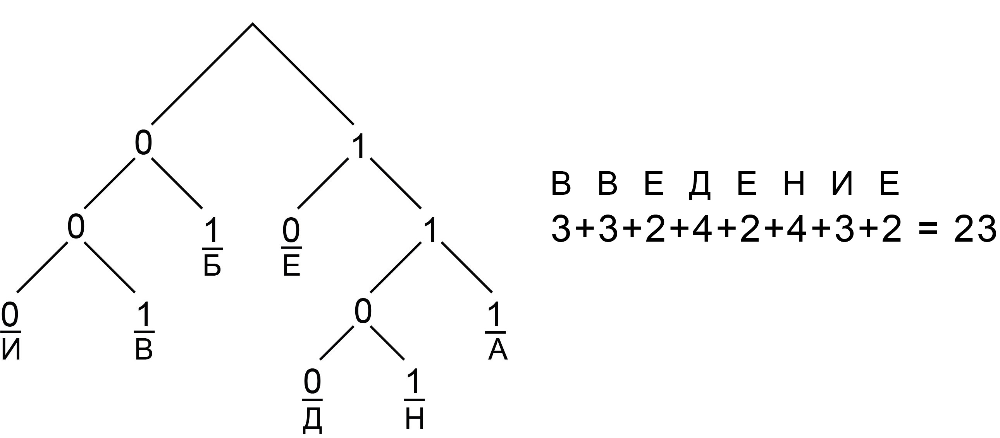
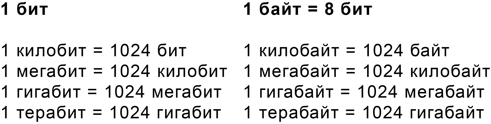
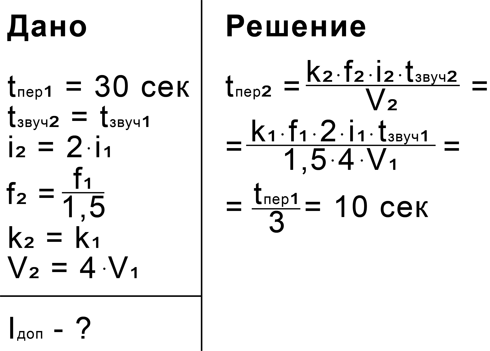
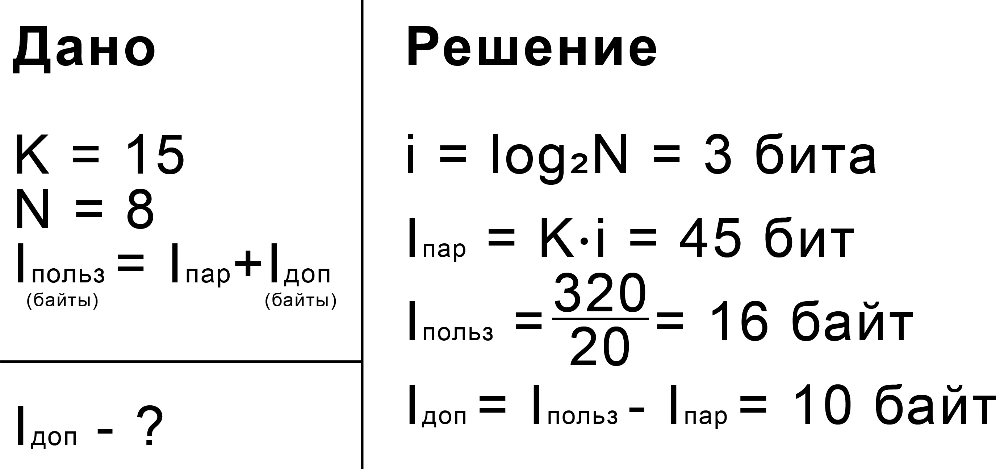
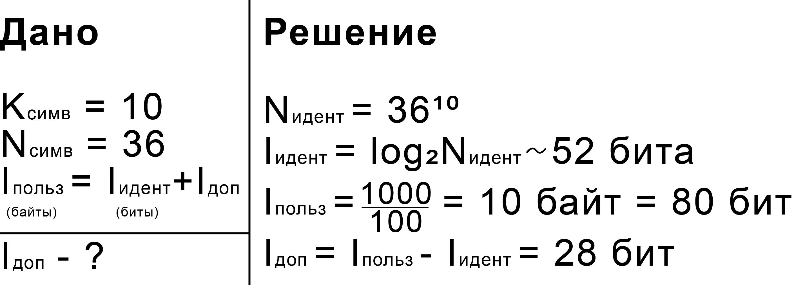
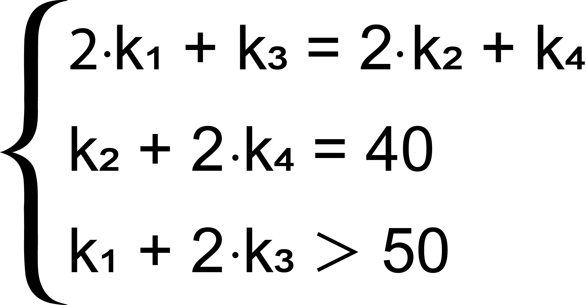

# ЕГЭ 2023

Здесь будет много полезной информации, я в процессе создания!

## №1 - Анализ информационных моделей (работа с графами)

**_Граф_** - математическая модель, состоящая из точек (вершин) и линий (ребер)

**_Ориентированный граф_** - ребрами являются стрелкки, двигаться можно только в указанном направлении

**_Неориентированный граф_** - ребрами являются линии, двигаться можно в любом направлении

**_Взвешенный граф_** - каждому ребру соответсвует значение (вес ребра)

**_Степень вершины_** - число ребер графа, которым принадлежит вершина. В ориентированных графах выделяют входящую
и исходящую степени

### Алгоритм решения

1. Определить степени вершин
2. Определить соседние вершины

### Пример

[**_РешуЕГЭ - №10377_**](https://inf-ege.sdamgia.ru/problem?id=10377)

1. **Степени вершин**  
   А = 3  
   Б = 2 (П5)  
   В = 4  
   Г = 5 (П2)  
   Д = 4  
   Е = 3  
   К = 3
2. **Соседние вершины**  
   Б (П5) связана с Г (П2) и А (П3). Искомое расстояние - путь между П2 и П3.  

**Ответ:** 22

## №2 - Построение таблиц истинности логических выражений



### Порядок выполнения логических операций

1. Инверсия (логическое отрицание)
2. Конъюнкция (логическое умножение)
3. Дизъюнкция (логическое сложение) / XOR (исключающее ИЛИ)
4. Импликация (логическое следование)
5. Эквивалентность (логическое равенство)

**_На порядок выполнения логических операций можно влиять с помощью скобок!_**

### Основные тождества



### Алгоритм решения

1. Построить таблицу истинности 
   - Вручную
     - Определить порядок действий
     - Упростить выражение (если это возможно)
     - Построить таблицу истинности
   - С помощью программы
2. Отобрать подходящие строки таблицы истинности
3. Сопоставить выбранные строки со строками из условия

### Пример

[**_РешуЕГЭ - №15787_**](https://inf-ege.sdamgia.ru/problem?id=15787)

```python
'''
Инверсия - not
Конъюнкция - and
Дизъюнкция - or
XOR - !=
Импликация - <=
Эквивалентность - ==
'''

print('x y z w F')
for x in range(2):
    for y in range(2):
        for z in range(2):
            for w in range(2):
                F = int(((x <= y) and (y <= w)) or (z == (x or y)))
                if F == 0:
                    print(x, y, z, w, F)

'''
РЕЗУЛЬТАТ РАБОТЫ ПРОГРАММЫ

x y z w F
0 1 0 0 0
1 0 0 0 0
1 0 0 1 0
1 1 0 0 0
'''
```

Обратим внимание, что в условии всего 2 строки, содержащих 2 единицы - в получившейся таблице тоже. Более того, есть
лишь 1 столбец, который в обеих строках содержит единицу.Таким образом мы можем определить, что четвертому столбцу
соответствует переменная **_x_**. Единтсвенная переменная, которая не равна единице ни в одной из строк, где **_x_**
равен единице - **_z_**, следовательно она соответствует третьему столбцу. Обратим внимание, что в строках содержащих 1
единицу, она соответствует либо **_x_**, либо **_y_**, но **_x_** - четвертый столбец, а единица стоит в первом,
следовательно **_y_** соответствует первому столбцу. По остаточному принципу второму столбцу соответствует **_w_**.

**Ответ:** ywzx

## №4 - Кодирование и декодирование информации

**_Условие Фано_** - никакое кодовое слово не может быть началом другого кодового слова

### Пример

[**_РешуЕГЭ - №16881_**](https://inf-ege.sdamgia.ru/problem?id=16881)



**Ответ:** 23

## №5 - Анализ и построение алгоритмов для исполнителей

[**_Перевод в десятичную систему_**](http://informatics-lesson.ru/notations/translation-decimal-system.php)

[**_Перевод из десятичной системы_**](http://informatics-lesson.ru/notations/translation-decimal-p-ichnou.php)

[**_Перевод между степенями по одному основанию_**](http://informatics-lesson.ru/notations/translation-power-two.php)

**_Шпаргалка по переводу чисел на Python_**

```python
#ИЗ ДЕСЯТИЧНОЙ СИСТЕМЫ СЧИСЛЕНИЯ

#В ДВОИЧНУЮ

print(bin(123))
#0b1111011
print(bin(123)[2:])
#1111011

#В ВОСЬМЕРИЧНУЮ

print(oct(123))
#0o173
print(oct(123)[2:])
#173

#В ШЕСТНАДЦАТЕРИЧНУЮ

print(hex(123))
#0x7b
print(hex(123)[2:])
#7b

#В ЛЮБУЮ

def perevod(num, osn):
    values = '0123456789ABCDEF'
    result = ''
    while num > 0:
        result = values[num % osn] + result
        num = num // osn
    return result

print(perevod(123, 9))
#146

#В ДЕСЯТИЧНУЮ

print(int('1111011', 2))
#123
print(int('173', 8))
#123
print(int('7b', 16))
#123
print('146', 9)
#123
```

### Пример

[**_РешуЕГЭ - №26978_**](https://inf-ege.sdamgia.ru/problem?id=26978)

Обратим внимание на то, что результат работы алгоритма должен быть меньше 109, следовательно в его двоичной записи не
более 7 цифр. По ходу выполнения алгоритма количество разрядов увеличивается на 2, а это значит, что в изначальном
числе их должно быть не больше 5, следовательно изначальное число меньше чем 32.

```python
maximum = 0
for N in range(1, 32):
    bin_N = bin(N)[2:]
    if N % 2 == 0:
        bin_N += '10'
    else:
        bin_N += '01'
    R = int(bin_N, 2)
    if R < 109:
        maximum = max(R, maximum)
print(maximum)
```

**Ответ:** 106

## №6 - Определение результатов работы простейших алгоритмов (черепашка)

[**_Библиотека Turtle_**](https://docs.python.org/3/library/turtle.html)

### Примеры

[**_РешуЕГЭ - №47303_**](https://inf-ege.sdamgia.ru/problem?id=47303)

При выполнении алгоритма исполнитель чертит фигуру с прямыми углами. В заданиях подобного типа необязательно писать
программу - достаточно нарисовать фигуру на бумаге. Ошибок из-за точности рисунка не случится. Результат работы
исполнителя - прямоугольник со сторонами 10 и 5. Умножаем 11 на 6 и получаем итоговый ответ.

**Ответ:** 66

[**_РешуЕГЭ - №47210_**](https://inf-ege.sdamgia.ru/problem?id=47210)

В заданиях с наклонными линиями одним рисунком не обойтись - нужно писать программу, а затем внимательно считать точки.

```python
from turtle import *

speed(0)
k = 30
left(90)
for i in range(7):
    forward(10 * k)
    right(120)
penup()
for x in range(0, 10):
    for y in range(0, 11):
        goto(x * k, y * k)
        dot(4)
done()
```

**Ответ:** 38

[**_РешуЕГЭ - №47391_**](https://inf-ege.sdamgia.ru/problem?id=47391)

В заданиях с большим ответом будет проблематично считать точки самостоятельно - необходимо видоизменить программу.

[**_Функция find_overlapping_**](https://anzeljg.github.io/rin2/book2/2405/docs/tkinter/canvas-methods.html)

```python
from turtle import *

speed(0)
k = 1000
left(90)
color('black', 'red')
begin_fill()
for i in range(12):
    right(60)
    forward(2 * k)
    right(60)
    forward(2 * k)
    right(270)
end_fill()
canvas = getcanvas()
counter = 0
for x in range(-100, 100):
    for y in range(-100, 100):
        s = canvas.find_overlapping(x * k, y * k, x * k, y * k)
        if len(s) == 1 and s[0] == 5:
            counter += 1
print(counter)
done()
```

**Ответ:** 149

**_При автоматическом подсчете необходимо указывать большой масштаб и количество итераций цикла, необходимое для
завершения фигуры_**

## №7 - Кодирование и декодирование информации. Передача информации



### Кодирование текста

I - информационный вес файла  
K - количество символов в тексте  
N - количество допустимых символов (мощность алфавита)  
i - информационный вес символа

**I = K * i**  
**N = 2<sup>i</sup>**

### Кодирование изображений

I - информационный вес файла  
K - количество пикселей в изображении  
N - количество допустимых цветов (мощность алфавита)  
i - информационный вес пикселя

**I = K * i**  
**N = 2<sup>i</sup>**

### Кодирование звука

I - информационный вес файла  
k - количество каналов  
f - частота дискретизации  
i - глубина кодирования  
t - время звучания

**I = k * f * i * t**  

### Вероятностный подход к измерению информации

I - информационный вес сообщения о событии  
p - вероятность события

**I = log<sub>2</sub>(1/p)**

### Пример

[**_РешуЕГЭ - №8097_**](https://inf-ege.sdamgia.ru/problem?id=8097)



**Ответ:** 10

## №8 - Перебор слов и системы счисления

### Примеры

[**_РешуЕГЭ - №8098_**](https://inf-ege.sdamgia.ru/problem?id=8098)

**_Аналитическое решение_**

Букву "С" можно поставить на одно из пяти мест. Для каждого из пяти способов есть 3<sup>4</sup> способов расставить
оставшиеся буквы (по 3 варианта на каждую из 4 позиций). 5 * 3<sup>4</sup> = 405

**_Решение на Python_**

[**_Библиотека Itertools_**](https://habr.com/ru/company/otus/blog/529356)

```python
from itertools import *
alphabet = "СЛОН"
words = product(alphabet, repeat = 5)
counter = 0
for element in words:
    if element.count('С') == 1:
        counter += 1
print(counter)
```

**Ответ:** 405

[**_РешуЕГЭ - №9162_**](https://inf-ege.sdamgia.ru/problem?id=9162)

Алфавит из 4 букв можно представить в виде системы счисления с основанием 4. Список слов дает нам понять, что: М = 0,
С = 1, Т = 2, Ф = 3. Обратиим внимание, что на 1 месте стоит число 0, следовательно на 138 месте стоит число
137<sub>10</sub> = 2021<sub>4</sub>

**Ответ:** ТМТС

ЗАДАЧА ПРО АБРАКАДАБРУ

**ВАЖНО!** [**_Число сочетаний_**](https://www.yaklass.ru/p/algebra/11-klass/nachalnye-svedeniia-kombinatoriki-9340/sochetaniia-i-ikh-svoistva-9344/re-9772d3f7-98a3-4363-a771-70d1e2306dc8)

## №9 - Работа с таблицами

## №11 - Вычисление количества информации

### Примеры

[**_РешуЕГЭ - №10289_**](https://inf-ege.sdamgia.ru/problem?id=10289)



**Ответ:** 10

[**_Сайт Константина Полякова - №5702_**](https://kpolyakov.spb.ru/school/ege/gen.php?action=viewTopic&topicId=5702)



**Ответ:** 28

## №12 - Выполнение алгоритмов для исполнителей

### Примеры

[**_РешуЕГЭ - №10388_**](https://inf-ege.sdamgia.ru/problem?id=10388)

В заданиях, где дана изначальная строка, достаточно написать программу, выполняющую алгоритм из условия

```python
s = '5' * 54 + '7'
while '722' in s or '557' in s:
    s = s.replace('722', '57', 1)
    s = s.replace('557', '72', 1)
print(s)
```

**Ответ:** 572

[**_РешуЕГЭ - №26957_**](https://inf-ege.sdamgia.ru/problem?id=26957)

В заданиях, где не дана изначальная строка, необходимо обратить внимание на алгоритм из условия. Есть вероятность, что
порядок, в котором стоят символы, не повлияет на результат работы алгоритма (как в этом случае)

```python
s = '>' + '1' * 26 + '2' * 10 + '3' * 14
while '>1' in s or '>2' in s or '>3' in s:
    s = s.replace('>1', '22>', 1)
    s = s.replace('>2', '2>', 1)
    s = s.replace('>3', '1>', 1)
summa = 0
for i in range(len(s) - 1):
    summa += int(s[i])
print(summa)
```

**Ответ:** 138

[**_СтатГрад (октябрь 2022) - №12_**](СтатГрад/2022-10/Вариант%20№1.pdf)

Однако бывают случаи, когда строка не дана, но порядок символов влияет на итоговый ответ. Пусть k1 раз выполняется
команда 1, k2 раз - команда 2 и тд. Получаем систему уравнений, которую можно решить с помощью Python



```python
minimum = 10 ** 12
for k1 in range(81):
    for k2 in range(81):
        for k3 in range(81):
            for k4 in range(81):
                if 2 * k1 + k3 == 2 * k2 + k4 and k2 + 2 * k4 == 40 and k1 + 2 * k3 > 50:
                    minimum = min(k1 + 2 * k3, minimum)
print(minimum)
```

**Ответ:** 52

## №13 - Поиск путей в графе

### Пример

[**_РешуЕГЭ - №10478_**](https://inf-ege.sdamgia.ru/problem?id=10478)

Для решения задач подобного типа необходимо присвоить значение стартовой вершине (0, если ищем расстояние, и 1, если
ищем количество путей)

А = **1**  
Б = А = **1**  
В = А + Б + Г = **4**  
Г = А + Д = **2**  
Д = А = **1**  
Е = Б + В = **5**  
Ж = В + Е + З = **16**  
З = В + Г + Д = **7**  
И = ~~Е~~ + Ж + ~~З~~ = **16**  
К = 0  
Л = Ж = **16**  
М = К + Л = **16**

**Ответ:** 16

[**_Сайт Константина Полякова - №5699_**](https://kpolyakov.spb.ru/school/ege/gen.php?action=viewTopic&topicId=5699)

Решить данную задачу таким же способом не выйдет - необходимо разбить на случаи. Также стоит обратить внимание на то,
что маршруты с ребром М -> З всегда нарушают условие "не проходящих дважды через один пункт", следовательно можно
игнорировать данное ребро

**_В маршруте есть З -> Д_**

Ж = **1**  
З = Ж = **1**  
Д = З = **1**  
К = Д = **1**  
Л = К = **1**  
М = Л = **1**  
Н = М = **1**  
А = М + Н = **2**  
Б = А + Н = **3**  
В = Б + Н = **4**  
Г = В = **4**  
Е = В + Г + Д = **9**  
Ж = В + Д + Е = **14**

**_В маршруте нет З -> Д_**

Ж = **1**  
З = Ж = **1**   
К = З = **1**  
Л = 3 + К = **2**  
М = Л = **2**  
Н = Ж + М = **3**  
А = М + Н = **5**  
Б = А + Н = **8**  
В = Б + Н = **11**  
Г = В = **11**  
Д = Г = **11**  
Е = В + Г + Д = **33**  
Ж = В + Д + Е = **55**

Складываем найденные значения и получаем итоговый ответ

**Ответ:** 69

## №14 - Кодирование чисел. Системы счисления

## №15 - Преобразование логических выражений

4 ВАРИАНТА ЗАДАЧ

## №16 - Рекурсивные алгоритмы

### Пример

[**_РешуЕГЭ - №4645_**](https://inf-ege.sdamgia.ru/problem?id=4645)

```python
def F(n):
    if n == 1:
        return 1
    elif n == 2:
        return 3
    elif n > 2:
        return F(n - 1) * n + F(n - 2) * (n - 1)

print(F(5))
```

**Ответ:** 309

**ВАЖНО!** Для решения задачи с маленьким значением параметра функции достаточно написать программу подобного типа. В
противном случае программа может выполняться долго, и тогда необходимо найти закономерность в результатах работы функции.
Также может помочь декоратор [**_lru_cache_**](https://www.geeksforgeeks.org/python-functools-lru_cache)

## №17 - Обработка числовых последовательностей

[**_Работа с файлами_**](https://pythonworld.ru/tipy-dannyx-v-python/fajly-rabota-s-fajlami.html)

### Пример

[**_РешуЕГЭ - №37373_**](https://inf-ege.sdamgia.ru/problem?id=37373)

```python
'''
ПАРЫ ПОДРЯД ИДУЩИХ ЭЛЕМЕНТОВ

for i in range(len(nums) - 1):
    print(nums[i], nums[i + 1])

ТРОЙКИ ПОДРЯД ИДУЩИХ ЭЛЕМЕНТОВ

for i in range(len(nums) - 2):
    print(nums[i], nums[i + 1], nums[i + 2])

ПАРЫ РАЗЛИЧНЫХ ЭЛЕМЕНТОВ

for i in range(len(nums)):
    for j in range(i + 1, len(nums)):
    print(nums[i], nums[j])

ТРОЙКИ РАЗЛИЧНЫХ ЭЛЕМЕНТОВ

for i in range(len(nums)):
    for j in range(i + 1, len(nums)):
        for k in range(j + 1, len(nums)):
    print(nums[i], nums[j], nums[k])
'''

f = open('37373.txt', 'r')
nums = []
for line in f:
    nums.append(int(line))
counter = 0
maximum = 0
for i in range(len(nums)):
    for j in range(i + 1, len(nums)):
        if abs(nums[i] - nums[j]) % 36 == 0 and (nums[i] % 13 == 0 or nums[j] % 13 == 0):
            counter += 1
            maximum = max(abs(nums[i] - nums[j]), maximum)
print(counter, maximum)
```

**Ответ:** 212587 9972

## №18 - Робот-сборщик монет

## №19 - Теория игр. Задание 1

РЕШЕНИЕ РУКАМИИ НА ОБЕ КУЧИ

## №20 - Теория игр. Задание 2

РУКАМИ НА 1 КУЧУ И EXCEL НА 2 КУЧИ

## №21 - Теория игр. Задание 3

РУКАМИ НА 1 КУЧУ И ПИТОН ДВУМЯ СПОСОБАМИ НА 2 КУЧИ

## №22 - Многопроцессорные системы

## №23 - Поиск количества программ

ПРОГА И НАПИСАТЬ ПОЧЕМУ НЕ ЧЕРЕЗ ФУНКЦИЮ

ПРОГА С ПУТЯМИ

ПРОГА С ПРОГРАММАМИ

## №24 - Обработка символьных строк

## №25 - Обработка целочисленной информации

## №26 - Обработка целочисленной информации

## №27 - Программирование