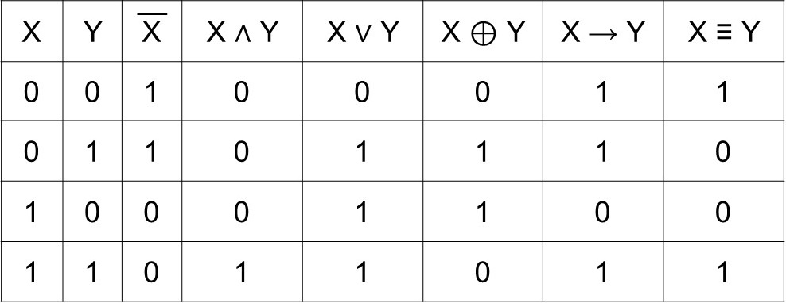
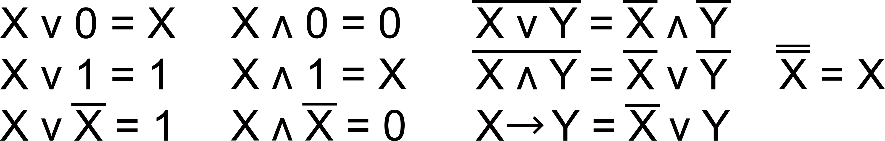
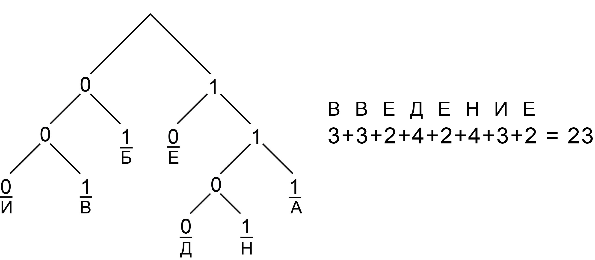
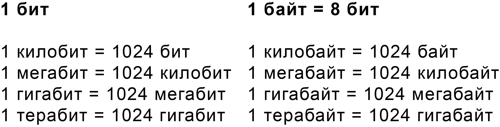
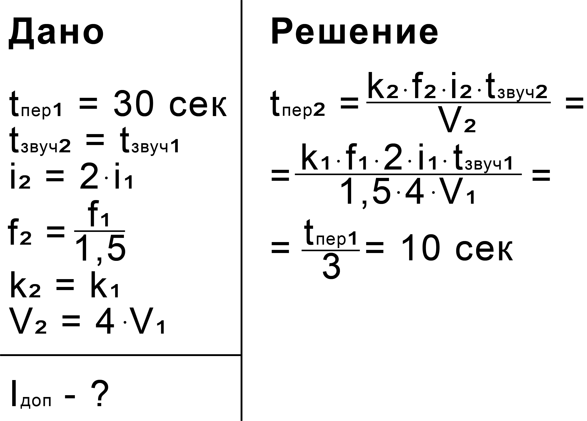
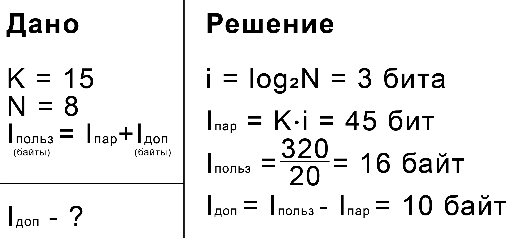
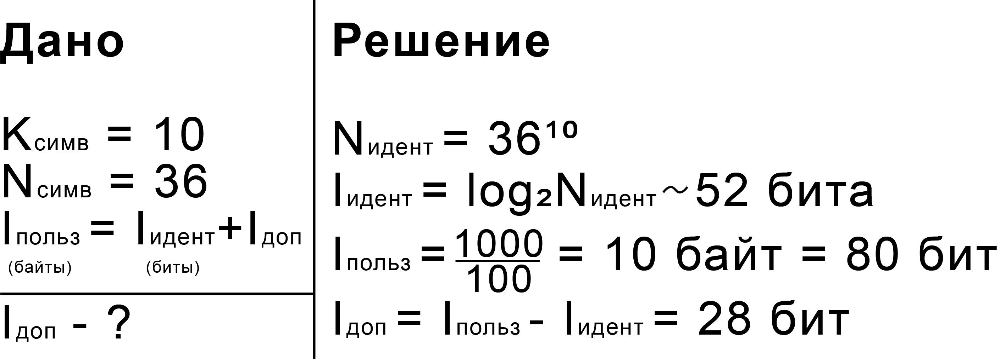
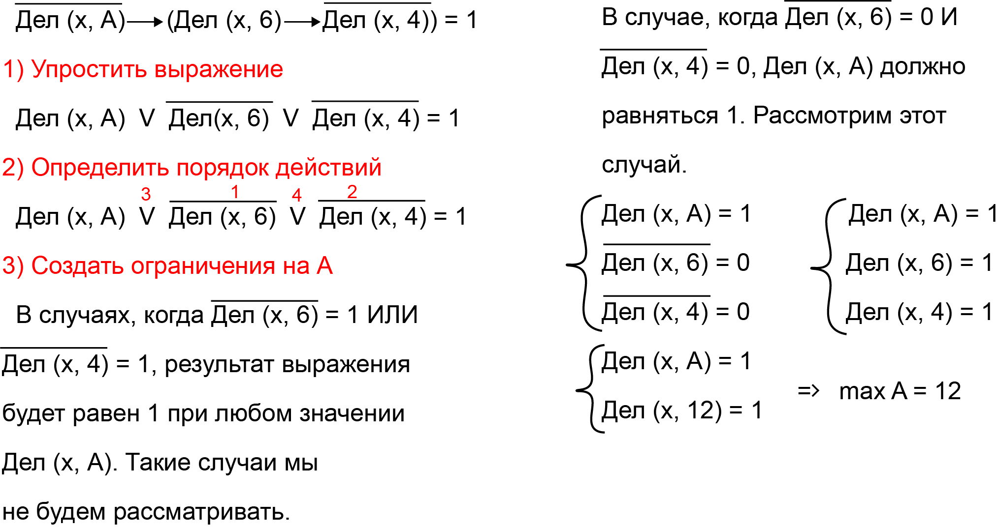
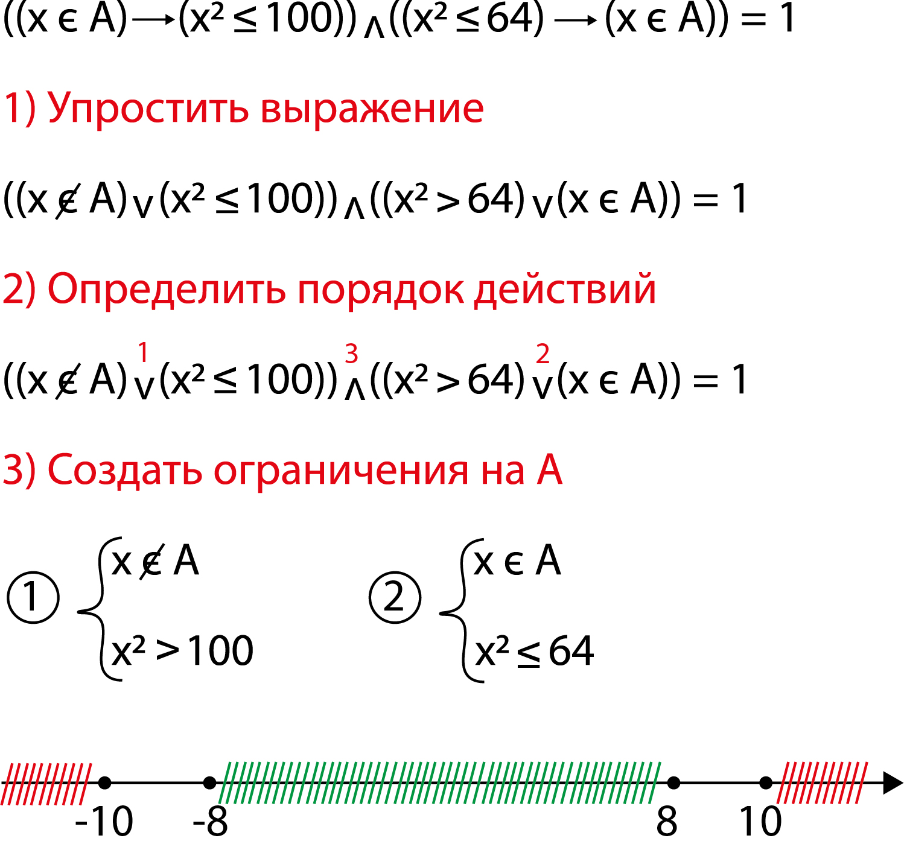
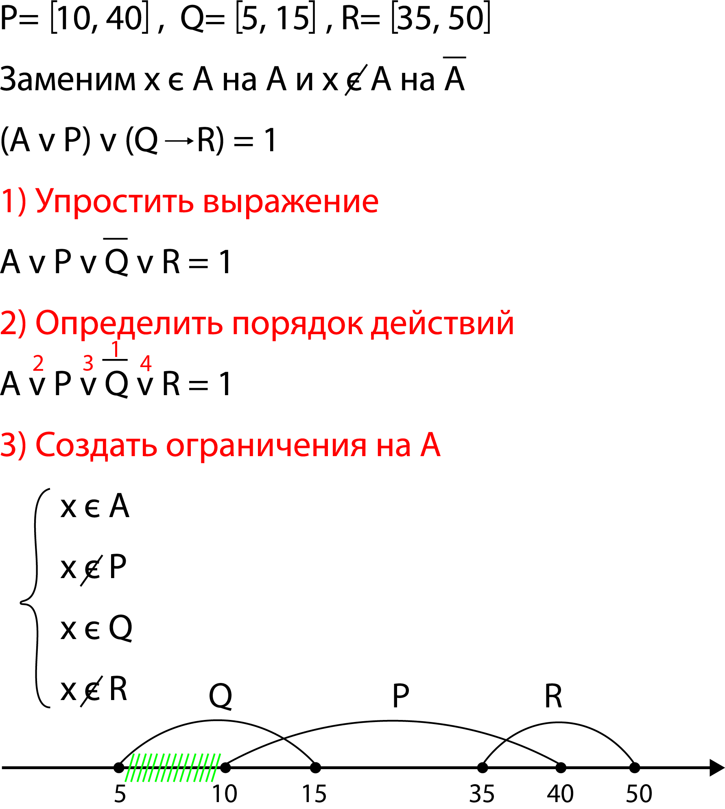

# ЕГЭ 2023

## Содержание

- <a href="#task-1">№1 - Анализ информационных моделей</a>
- <a href="#task-2">№2 - Построение таблиц истинности логических выражений</a>
- <a href="#task-3">№3 - Поиск информации в реляционных базах данных</a>
- <a href="#task-4">№4 - Кодирование и декодирование информации</a>
- <a href="#task-5">№5 - Анализ и построение алгоритмов для исполнителей</a>
- <a href="#task-6">№6 - Определение результатов работы простейших алгоритмов</a>
- <a href="#task-7">№7 - Кодирование и декодирование информации. Передача информации</a>
- <a href="#task-8">№8 - Перебор слов и системы счисления</a>
- <a href="#task-9">№9 - Работа с таблицами</a>
- <a href="#task-11">№11 - Вычисление количества информации</a>
- <a href="#task-12">№12 - Выполнение алгоритмов для исполнителей</a>
- <a href="#task-13">№13 - Поиск путей в графе</a>
- <a href="#task-14">№14 - Кодирование чисел. Системы счисления</a>
- <a href="#task-15">№15 - Преобразование логических выражений</a>
- <a href="#task-16">№16 - Рекурсивные алгоритмы</a>
- <a href="#task-17">№17 - Обработка числовых последовательностей</a>
- <a href="#task-18">№18 - Робот-сборщик монет</a>
- <a href="#task-19">№19 - Теория игр. Задание 1</a>
- <a href="#task-20">№20 - Теория игр. Задание 2</a>
- <a href="#task-21">№21 - Теория игр. Задание 3</a>
- <a href="#task-22">№22 - Многопроцессорные системы</a>
- <a href="#task-23">№23 - Поиск количества программ</a>
- <a href="#task-24">№24 - Обработка символьных строк</a>
- <a href="#task-25">№25 - Обработка целочисленной информации</a>
- <a href="#task-26">№26 - Обработка целочисленной информации</a>
- <a href="#task-27">№27 - Программирование</a>
- <a href="#algorithms">Стандартные алгоритмы</a>
  - <a href="#GCD-LCM">НОД и НОК</a>
  - <a href="#sieve-of-eratosthenes">Решето Эратосфена</a>
  - <a href="#binary-search">Бинарный поиск</a>
 
<a name="task-1"></a>

## №1 - Анализ информационных моделей

**_Граф_** - математическая модель, состоящая из точек (вершин) и линий (ребер)

**_Ориентированный граф_** - ребрами являются стрелкки, двигаться можно только в указанном направлении

**_Неориентированный граф_** - ребрами являются линии, двигаться можно в любом направлении

**_Взвешенный граф_** - каждому ребру соответсвует значение (вес ребра)

**_Степень вершины_** - число ребер графа, которым принадлежит вершина. В ориентированных графах выделяют входящую
и исходящую степени

### Алгоритм решения

1. Определить степени вершин
2. Определить соседние вершины

### Пример

[**_РешуЕГЭ - №10377_**](https://inf-ege.sdamgia.ru/problem?id=10377)

1. **Степени вершин**  
   А = 3  
   Б = 2 (П5)  
   В = 4  
   Г = 5 (П2)  
   Д = 4  
   Е = 3  
   К = 3
2. **Соседние вершины**  
   Б (П5) связана с Г (П2) и А (П3). Искомое расстояние - путь между П2 и П3.  

**Ответ:** 22

<a name="task-2"></a>

## №2 - Построение таблиц истинности логических выражений



### Порядок выполнения логических операций

1. Инверсия (логическое отрицание)
2. Конъюнкция (логическое умножение)
3. Дизъюнкция (логическое сложение) / XOR (исключающее ИЛИ)
4. Импликация (логическое следование)
5. Эквивалентность (логическое равенство)

**_На порядок выполнения логических операций можно влиять с помощью скобок!_**

### Основные тождества



### Алгоритм решения

1. Построить таблицу истинности 
   - Вручную
     - Определить порядок действий
     - Упростить выражение (если это возможно)
     - Построить таблицу истинности
   - С помощью программы
2. Отобрать подходящие строки таблицы истинности
3. Сопоставить выбранные строки со строками из условия

### Пример

[**_РешуЕГЭ - №15787_**](https://inf-ege.sdamgia.ru/problem?id=15787)

```python
'''
Инверсия - not
Конъюнкция - and
Дизъюнкция - or
XOR - !=
Импликация - <=
Эквивалентность - ==
'''

print('x y z w F')
for x in range(2):
    for y in range(2):
        for z in range(2):
            for w in range(2):
                F = int(((x <= y) and (y <= w)) or (z == (x or y)))
                if F == 0:
                    print(x, y, z, w, F)

'''
РЕЗУЛЬТАТ РАБОТЫ ПРОГРАММЫ

x y z w F
0 1 0 0 0
1 0 0 0 0
1 0 0 1 0
1 1 0 0 0
'''
```

Обратим внимание, что в условии всего 2 строки, содержащих 2 единицы - в получившейся таблице тоже. Более того, есть
лишь 1 столбец, который в обеих строках содержит единицу.Таким образом мы можем определить, что четвертому столбцу
соответствует переменная **_x_**. Единтсвенная переменная, которая не равна единице ни в одной из строк, где **_x_**
равен единице - **_z_**, следовательно она соответствует третьему столбцу. Обратим внимание, что в строках содержащих 1
единицу, она соответствует либо **_x_**, либо **_y_**, но **_x_** - четвертый столбец, а единица стоит в первом,
следовательно **_y_** соответствует первому столбцу. По остаточному принципу второму столбцу соответствует **_w_**.

**Ответ:** ywzx

<a name="task-3"></a>

## №3 - Поиск информации в реляционных базах данных

### Пример

[**_РешуЕГЭ - №38937_**](https://inf-ege.sdamgia.ru/problem?id=38937)

https://user-images.githubusercontent.com/99151010/222596567-11df13f6-886a-4e30-80e5-c139101ee6b4.mp4

**Ответ:** 241080

<a name="task-4"></a>

## №4 - Кодирование и декодирование информации

**_Условие Фано_** - никакое кодовое слово не может быть началом другого кодового слова

### Пример

[**_РешуЕГЭ - №16881_**](https://inf-ege.sdamgia.ru/problem?id=16881)



**Ответ:** 23

<a name="task-5"></a>

## №5 - Анализ и построение алгоритмов для исполнителей

[**_Перевод в десятичную систему_**](http://informatics-lesson.ru/notations/translation-decimal-system.php)

[**_Перевод из десятичной системы_**](http://informatics-lesson.ru/notations/translation-decimal-p-ichnou.php)

[**_Перевод между степенями по одному основанию_**](http://informatics-lesson.ru/notations/translation-power-two.php)

**_Шпаргалка по переводу чисел на Python_**

```python
#ИЗ ДЕСЯТИЧНОЙ СИСТЕМЫ СЧИСЛЕНИЯ

#В ДВОИЧНУЮ

print(bin(123))
#0b1111011
print(bin(123)[2:])
#1111011

#В ВОСЬМЕРИЧНУЮ

print(oct(123))
#0o173
print(oct(123)[2:])
#173

#В ШЕСТНАДЦАТЕРИЧНУЮ

print(hex(123))
#0x7b
print(hex(123)[2:])
#7b

#В ЛЮБУЮ

def perevod(num, osn):
    values = '0123456789ABCDEF'
    result = ''
    while num > 0:
        result = values[num % osn] + result
        num = num // osn
    return result

print(perevod(123, 9))
#146

#В ДЕСЯТИЧНУЮ

print(int('1111011', 2))
#123
print(int('173', 8))
#123
print(int('7b', 16))
#123
print('146', 9)
#123
```

### Пример

[**_РешуЕГЭ - №26978_**](https://inf-ege.sdamgia.ru/problem?id=26978)

Обратим внимание на то, что результат работы алгоритма должен быть меньше 109, следовательно в его двоичной записи не
более 7 цифр. По ходу выполнения алгоритма количество разрядов увеличивается на 2, а это значит, что в изначальном
числе их должно быть не больше 5, следовательно изначальное число меньше чем 32.

```python
maximum = 0
for N in range(1, 32):
    bin_N = bin(N)[2:]
    if N % 2 == 0:
        bin_N += '10'
    else:
        bin_N += '01'
    R = int(bin_N, 2)
    if R < 109:
        maximum = max(R, maximum)
print(maximum)
```

**Ответ:** 106

<a name="task-6"></a>

## №6 - Определение результатов работы простейших алгоритмов

[**_Библиотека Turtle_**](https://docs.python.org/3/library/turtle.html)

### Примеры

[**_РешуЕГЭ - №47303_**](https://inf-ege.sdamgia.ru/problem?id=47303)

При выполнении алгоритма исполнитель чертит фигуру с прямыми углами. В заданиях подобного типа необязательно писать
программу - достаточно нарисовать фигуру на бумаге. Ошибок из-за точности рисунка не случится. Результат работы
исполнителя - прямоугольник со сторонами 10 и 5. Умножаем 11 на 6 и получаем итоговый ответ.

**Ответ:** 66

[**_РешуЕГЭ - №47210_**](https://inf-ege.sdamgia.ru/problem?id=47210)

В заданиях с наклонными линиями одним рисунком не обойтись - нужно писать программу, а затем внимательно считать точки.

```python
from turtle import *

speed(0)
k = 30
left(90)
for i in range(7):
    forward(10 * k)
    right(120)
penup()
for x in range(0, 10):
    for y in range(0, 11):
        goto(x * k, y * k)
        dot(4)
done()
```

**Ответ:** 38

[**_РешуЕГЭ - №47391_**](https://inf-ege.sdamgia.ru/problem?id=47391)

В заданиях с большим ответом будет проблематично считать точки самостоятельно - необходимо видоизменить программу.

[**_Метод find_overlapping_**](https://anzeljg.github.io/rin2/book2/2405/docs/tkinter/canvas-methods.html)

```python
from turtle import *

speed(0)
k = 1000
left(90)
color('black', 'red')
begin_fill()
for i in range(12):
    right(60)
    forward(2 * k)
    right(60)
    forward(2 * k)
    right(270)
end_fill()
canvas = getcanvas()
counter = 0
for x in range(-100, 100):
    for y in range(-100, 100):
        s = canvas.find_overlapping(x * k, y * k, x * k, y * k)
        if len(s) == 1 and s[0] == 5:
            counter += 1
print(counter)
done()
```

**Ответ:** 149

**_При автоматическом подсчете необходимо указывать большой масштаб и количество итераций цикла, необходимое для
завершения фигуры - лишние итерации не нужны_**

**_Обратите внимание на то, что библиотека Turtle использует привычную нам систему координат (ось X направлена вправо, 
ось Y - вверх), но find_overlapping является методом canvas (холста), а в canvas система координат устроена по-другому
(ось X - вправо, ось Y - вниз). Учитывайте это при выборе диапазона значений для X и Y!_**

<a name="task-7"></a>

## №7 - Кодирование и декодирование информации. Передача информации



### Кодирование текста

I - информационный вес файла  
K - количество символов в тексте  
N - количество допустимых символов (мощность алфавита)  
i - информационный вес символа

**I = K * i**  
**N = 2<sup>i</sup>**

### Кодирование изображений

I - информационный вес файла  
K - количество пикселей в изображении  
N - количество допустимых цветов (мощность алфавита)  
i - информационный вес пикселя

**I = K * i**  
**N = 2<sup>i</sup>**

### Кодирование звука

I - информационный вес файла  
k - количество каналов  
f - частота дискретизации  
i - глубина кодирования  
t - время звучания

**I = k * f * i * t**  

### Вероятностный подход к измерению информации

I - информационный вес сообщения о событии  
p - вероятность события

**I = log<sub>2</sub>(1/p)**

### Пример

[**_РешуЕГЭ - №8097_**](https://inf-ege.sdamgia.ru/problem?id=8097)



**Ответ:** 10

<a name="task-8"></a>

## №8 - Перебор слов и системы счисления

### Примеры

[**_РешуЕГЭ - №8098_**](https://inf-ege.sdamgia.ru/problem?id=8098)

**_Аналитическое решение_**

Букву "С" можно поставить на одно из пяти мест. Для каждого из пяти способов есть 3<sup>4</sup> способов расставить
оставшиеся буквы (по 3 варианта на каждую из 4 позиций). 5 * 3<sup>4</sup> = 405

**_Решение на Python_**

[**_Библиотека Itertools_**](https://habr.com/ru/company/otus/blog/529356)

```python
from itertools import *
alphabet = "СЛОН"
words = product(alphabet, repeat = 5)
counter = 0
for element in words:
    if element.count('С') == 1:
        counter += 1
print(counter)
```

**Ответ:** 405

[**_РешуЕГЭ - №9162_**](https://inf-ege.sdamgia.ru/problem?id=9162)

Алфавит из 4 букв можно представить в виде системы счисления с основанием 4. Список слов дает нам понять, что: М = 0,
С = 1, Т = 2, Ф = 3. Обратиим внимание, что на 1 месте стоит число 0, следовательно на 138 месте стоит число
137<sub>10</sub> = 2021<sub>4</sub>

**Ответ:** ТМТС

[**_Число сочетаний_**](https://www.yaklass.ru/p/algebra/11-klass/nachalnye-svedeniia-kombinatoriki-9340/sochetaniia-i-ikh-svoistva-9344/re-9772d3f7-98a3-4363-a771-70d1e2306dc8)

[**_Сайт Константина Полякова - №1961_**](https://kpolyakov.spb.ru/school/ege/gen.php?action=viewTopic&topicId=1961)

Воспользуемся формулой для вычисления числа сочетаний. Есть 35 способов расставить буквы А и для каждого из них есть
4 способа расставить буквы Т. 35 * 4 = 140

**Ответ:** 140

<a name="task-9"></a>

## №9 - Работа с таблицами

### Примеры

[**_РешуЕГЭ - №33088_**](https://inf-ege.sdamgia.ru/problem?id=33088)

https://user-images.githubusercontent.com/99151010/222611605-48da7b83-3bb3-4aa4-b01e-2c65ba86c597.mp4

**Ответ:** 6

[**_РешуЕГЭ - №38943_**](https://inf-ege.sdamgia.ru/problem?id=38943)

https://user-images.githubusercontent.com/99151010/222609456-ff929068-d93a-4282-a78e-13abde4a3e46.mp4

**Ответ:** 1074

<a name="task-11"></a>

## №11 - Вычисление количества информации

### Примеры

[**_РешуЕГЭ - №10289_**](https://inf-ege.sdamgia.ru/problem?id=10289)



**Ответ:** 10

[**_Сайт Константина Полякова - №5702_**](https://kpolyakov.spb.ru/school/ege/gen.php?action=viewTopic&topicId=5702)



**Ответ:** 28

<a name="task-12"></a>

## №12 - Выполнение алгоритмов для исполнителей

### Примеры

[**_РешуЕГЭ - №10388_**](https://inf-ege.sdamgia.ru/problem?id=10388)

В заданиях, где дана изначальная строка, достаточно написать программу, выполняющую алгоритм из условия

```python
s = '5' * 54 + '7'
while '722' in s or '557' in s:
    s = s.replace('722', '57', 1)
    s = s.replace('557', '72', 1)
print(s)
```

**Ответ:** 572

[**_РешуЕГЭ - №26957_**](https://inf-ege.sdamgia.ru/problem?id=26957)

В заданиях, где не дана изначальная строка, необходимо обратить внимание на алгоритм из условия. Есть вероятность, что
порядок, в котором стоят символы, не повлияет на результат работы алгоритма (как в этом случае)

```python
s = '>' + '1' * 26 + '2' * 10 + '3' * 14
while '>1' in s or '>2' in s or '>3' in s:
    s = s.replace('>1', '22>', 1)
    s = s.replace('>2', '2>', 1)
    s = s.replace('>3', '1>', 1)
summa = 0
for i in range(len(s) - 1):
    summa += int(s[i])
print(summa)
```

**Ответ:** 138

**_В тех случаях, когда исходная строка неизвестна и порядок цифр влияет на итоговый результат, можно перебрать все
подходящие строки (в адекватных пределах)_**

<a name="task-13"></a>

## №13 - Поиск путей в графе

### Пример

[**_РешуЕГЭ - №10478_**](https://inf-ege.sdamgia.ru/problem?id=10478)

Для решения задач подобного типа необходимо присвоить значение стартовой вершине (0, если ищем расстояние, и 1, если
ищем количество путей)

А = **1**  
Б = А = **1**  
В = А + Б + Г = **4**  
Г = А + Д = **2**  
Д = А = **1**  
Е = Б + В = **5**  
Ж = В + Е + З = **16**  
З = В + Г + Д = **7**  
И = ~~Е~~ + Ж + ~~З~~ = **16**  
К = 0  
Л = Ж = **16**  
М = К + Л = **16**

**Ответ:** 16

[**_Сайт Константина Полякова - №5699_**](https://kpolyakov.spb.ru/school/ege/gen.php?action=viewTopic&topicId=5699)

Решить данную задачу таким же способом не выйдет - необходимо разбить на случаи. Также стоит обратить внимание на то,
что маршруты с ребром М -> З всегда нарушают условие "не проходящих дважды через один пункт", следовательно можно
игнорировать данное ребро

**_В маршруте есть З -> Д_**

Ж = **1**  
З = Ж = **1**  
Д = З = **1**  
К = Д = **1**  
Л = К = **1**  
М = Л = **1**  
Н = М = **1**  
А = М + Н = **2**  
Б = А + Н = **3**  
В = Б + Н = **4**  
Г = В = **4**  
Е = В + Г + Д = **9**  
Ж = В + Д + Е = **14**

**_В маршруте нет З -> Д_**

Ж = **1**  
З = Ж = **1**   
К = З = **1**  
Л = 3 + К = **2**  
М = Л = **2**  
Н = Ж + М = **3**  
А = М + Н = **5**  
Б = А + Н = **8**  
В = Б + Н = **11**  
Г = В = **11**  
Д = Г = **11**  
Е = В + Г + Д = **33**  
Ж = В + Д + Е = **55**

Складываем найденные значения и получаем итоговый ответ

**Ответ:** 69

<a name="task-14"></a>

## №14 - Кодирование чисел. Системы счисления

### Примеры

[**_РешуЕГЭ - №48384_**](https://inf-ege.sdamgia.ru/problem?id=48384)

```python
minimum = 10 ** 12
for x in range(9):
    for y in range(9):
        result = (8 * 9 ** 4) + (8 * 9 ** 3) + (x * 9 ** 2) + (4 * 9) + y + (7 * 11 ** 4) + (x * 11 ** 3) + (4 * 11 ** 2) + (4 * 11) + y
        if result % 61 == 0:
            minimum = min(result, minimum)
print(minimum // 61)
```

**Ответ:** 2715

[**_РешуЕГЭ - №8664_**](https://inf-ege.sdamgia.ru/problem?id=8664)

```python
num = 8 ** 2020 + 4 ** 2017 + 26 - 1
stroka = bin(num)[2:]
print(stroka.count('1'))
```

**Ответ:** 5

<a name="task-15"></a>

## №15 - Преобразование логических выражений

### Примеры

[**_РешуЕГЭ - №8106_**](https://inf-ege.sdamgia.ru/problem?id=8106)



**Ответ:** 12

[**_РешуЕГЭ - №15830_**](https://inf-ege.sdamgia.ru/problem?id=15830)



**Ответ:** 16

[**_РешуЕГЭ - №34508_**](https://inf-ege.sdamgia.ru/problem?id=34508)

```python
for A in range(32):
    for x in range(32):
        if not ((x & 29 != 0) <= ((x & 12 == 0) <= (x & A != 0))):
            break
    else:
        print(A)
        break
```

**Ответ:** 17

[**_РешуЕГЭ - №34535_**](https://inf-ege.sdamgia.ru/problem?id=34535)



**Ответ:** 5

<a name="task-16"></a>

## №16 - Рекурсивные алгоритмы

### Пример

[**_РешуЕГЭ - №4645_**](https://inf-ege.sdamgia.ru/problem?id=4645)

```python
def F(n):
    if n == 1:
        return 1
    elif n == 2:
        return 3
    elif n > 2:
        return F(n - 1) * n + F(n - 2) * (n - 1)

print(F(5))
```

**Ответ:** 309

**ВАЖНО!** Для решения задачи с маленьким значением параметра функции достаточно написать программу подобного типа. В
противном случае программа может выполняться долго, и тогда необходимо найти закономерность в результатах работы функции.
Также может помочь декоратор [**_lru_cache_**](https://www.geeksforgeeks.org/python-functools-lru_cache)

<a name="task-17"></a>

## №17 - Обработка числовых последовательностей

[**_Работа с файлами_**](https://pythonworld.ru/tipy-dannyx-v-python/fajly-rabota-s-fajlami.html)

### Пример

[**_РешуЕГЭ - №37373_**](https://inf-ege.sdamgia.ru/problem?id=37373)

```python
'''
ПАРЫ ПОДРЯД ИДУЩИХ ЭЛЕМЕНТОВ

for i in range(len(nums) - 1):
    print(nums[i], nums[i + 1])

ТРОЙКИ ПОДРЯД ИДУЩИХ ЭЛЕМЕНТОВ

for i in range(len(nums) - 2):
    print(nums[i], nums[i + 1], nums[i + 2])

ПАРЫ РАЗЛИЧНЫХ ЭЛЕМЕНТОВ

for i in range(len(nums)):
    for j in range(i + 1, len(nums)):
    print(nums[i], nums[j])

ТРОЙКИ РАЗЛИЧНЫХ ЭЛЕМЕНТОВ

for i in range(len(nums)):
    for j in range(i + 1, len(nums)):
        for k in range(j + 1, len(nums)):
    print(nums[i], nums[j], nums[k])
'''

f = open('37373.txt')
nums = []
for line in f:
    nums.append(int(line))
counter = 0
maximum = 0
for i in range(len(nums)):
    for j in range(i + 1, len(nums)):
        if abs(nums[i] - nums[j]) % 36 == 0 and (nums[i] % 13 == 0 or nums[j] % 13 == 0):
            counter += 1
            maximum = max(abs(nums[i] - nums[j]), maximum)
print(counter, maximum)
```

**Ответ:** 212587 9972

<a name="task-18"></a>

## №18 - Робот-сборщик монет

### Примеры

[**_РешуЕГЭ - №27415_**](https://inf-ege.sdamgia.ru/problem?id=27415)

https://user-images.githubusercontent.com/99151010/222609527-a0911e1a-8fdc-420b-9f51-857ef1989336.mp4

**Ответ:** 1204502

[**_РешуЕГЭ - №33190_**](https://inf-ege.sdamgia.ru/problem?id=33190)

https://user-images.githubusercontent.com/99151010/222609767-e111c284-1a6d-4088-9093-5edb7de73bd5.mp4

**Ответ:** 80

[**_РешуЕГЭ - №33520_**](https://inf-ege.sdamgia.ru/problem?id=33520)

https://user-images.githubusercontent.com/99151010/222609789-63c57a8f-0443-4b19-9e65-f8a207216496.mp4

**Ответ:** 323

<a name="task-19"></a>

## №19 - Теория игр. Задание 1

### Примеры

[**_Сайт Константина Полякова - №5376_**](https://kpolyakov.spb.ru/school/ege/gen.php?action=viewTopic&topicId=5376)

```python
from functools import *

def moves(num_1, num_2):
    return [(num_1 + 1, num_2), (num_1, num_2 + 1), (num_1 * 2, num_2), (num_1, num_2 * 2)]

@lru_cache(None)
def game(num_1, num_2):
    if num_1 + num_2 >= 259:
        return 'W'
    if any(game(i, j) == 'W' for i, j in moves(num_1, num_2)):
        return 'W1'
    if any(game(i, j) == 'W1' for i, j in moves(num_1, num_2)):
        return 'L1'

for S in range(1, 242):
    if game(17, S) == 'L1':
        print(S)
        break
```

**Ответ:** 61

[**_Сайт Константина Полякова - №3489_**](https://kpolyakov.spb.ru/school/ege/gen.php?action=viewTopic&topicId=3489)

```python
from functools import *

def moves(num_1, num_2):
    result = []
    if num_1 > 0:
        result.append((num_1 - 1, num_2))
        result.append(((num_1 - (num_1 % 2)) // 2, num_2))
    if num_2 > 0:
        result.append((num_1, num_2 - 1))
        result.append((num_1, (num_2 - (num_2 % 2)) // 2))
    return result

@lru_cache(None)
def game(num_1, num_2):
    if num_1 + num_2 <= 18:
        return 'W'
    if any(game(i, j) == 'W' for i, j in moves(num_1, num_2)):
        return 'W1'
    if all(game(i, j) == 'W1' for i, j in moves(num_1, num_2)):
        return 'L1'

for M in range(10, 100):
    if game(M, M) == 'L1':
        print(M)
        break
```

**Ответ:** 13

<a name="task-20"></a>

## №20 - Теория игр. Задание 2

### Примеры

[**_Сайт Константина Полякова - №5376_**](https://kpolyakov.spb.ru/school/ege/gen.php?action=viewTopic&topicId=5376)

```python
from functools import *

def moves(num_1, num_2):
    return [(num_1 + 1, num_2), (num_1, num_2 + 1), (num_1 * 2, num_2), (num_1, num_2 * 2)]

@lru_cache(None)
def game(num_1, num_2):
    if num_1 + num_2 >= 259:
        return 'W'
    if any(game(i, j) == 'W' for i, j in moves(num_1, num_2)):
        return 'W1'
    if all(game(i, j) == 'W1' for i, j in moves(num_1, num_2)):
        return 'L1'
    if any(game(i, j) == 'L1' for i, j in moves(num_1, num_2)):
        return 'W2'

for S in range(1, 242):
    if game(17, S) == 'W2':
        print(S)
```

**Ответ:** 112 120

[**_Сайт Константина Полякова - №3489_**](https://kpolyakov.spb.ru/school/ege/gen.php?action=viewTopic&topicId=3489)

```python
from functools import *

def moves(num_1, num_2):
    result = []
    if num_1 > 0:
        result.append((num_1 - 1, num_2))
        result.append(((num_1 - (num_1 % 2)) // 2, num_2))
    if num_2 > 0:
        result.append((num_1, num_2 - 1))
        result.append((num_1, (num_2 - (num_2 % 2)) // 2))
    return result

@lru_cache(None)
def game(num_1, num_2):
    if num_1 + num_2 <= 18:
        return 'W'
    if any(game(i, j) == 'W' for i, j in moves(num_1, num_2)):
        return 'W1'
    if all(game(i, j) == 'W1' for i, j in moves(num_1, num_2)):
        return 'L1'
    if any(game(i, j) == 'L1' for i, j in moves(num_1, num_2)):
        return 'W2'

for S in range(6, 100):
    if game(13, S) == 'W2':
        print(S)
```

**Ответ:** 14 27

<a name="task-21"></a>

## №21 - Теория игр. Задание 3

### Примеры

[**_Сайт Константина Полякова - №5376_**](https://kpolyakov.spb.ru/school/ege/gen.php?action=viewTopic&topicId=5376)

```python
from functools import *

def moves(num_1, num_2):
    return [(num_1 + 1, num_2), (num_1, num_2 + 1), (num_1 * 2, num_2), (num_1, num_2 * 2)]

@lru_cache(None)
def game(num_1, num_2):
    if num_1 + num_2 >= 259:
        return 'W'
    if any(game(i, j) == 'W' for i, j in moves(num_1, num_2)):
        return 'W1'
    if all(game(i, j) == 'W1' for i, j in moves(num_1, num_2)):
        return 'L1'
    if any(game(i, j) == 'L1' for i, j in moves(num_1, num_2)):
        return 'W2'
    if all(game(i, j) == 'W1' or game(i, j) == 'W2' for i, j in moves(num_1, num_2)):
        return 'L2'

for S in range(1, 242):
    if game(17, S) == 'L2':
        print(S)
        break
```

**Ответ:** 111

[**_Сайт Константина Полякова - №3489_**](https://kpolyakov.spb.ru/school/ege/gen.php?action=viewTopic&topicId=3489)

```python
from functools import *

def moves(num_1, num_2):
    result = []
    if num_1 > 0:
        result.append((num_1 - 1, num_2))
        result.append(((num_1 - (num_1 % 2)) // 2, num_2))
    if num_2 > 0:
        result.append((num_1, num_2 - 1))
        result.append((num_1, (num_2 - (num_2 % 2)) // 2))
    return result

@lru_cache(None)
def game(num_1, num_2):
    if num_1 + num_2 <= 18:
        return 'W'
    if any(game(i, j) == 'W' for i, j in moves(num_1, num_2)):
        return 'W1'
    if all(game(i, j) == 'W1' for i, j in moves(num_1, num_2)):
        return 'L1'
    if any(game(i, j) == 'L1' for i, j in moves(num_1, num_2)):
        return 'W2'
    if all(game(i, j) == 'W1' or game(i, j) == 'W2' for i, j in moves(num_1, num_2)):
        return 'L2'

for N in range(10, 100):
    if game(N, N) == 'L2':
        print(N)
        break
```

**Ответ:** 14

<a name="task-22"></a>

## №22 - Многопроцессорные системы

### Пример

[**_РешуЕГЭ - №47616_**](https://inf-ege.sdamgia.ru/problem?id=47616)

https://user-images.githubusercontent.com/99151010/222609716-5f2412de-cc65-47b4-bd44-0ed5845a3ba3.mp4

**Ответ:** 54

<a name="task-23"></a>

## №23 - Поиск количества программ

### Примеры

[**_РешуЕГЭ - №15932_**](https://inf-ege.sdamgia.ru/problem?id=15932)

```python
data = [0] * 45
data[2] = 1
for i in range(3, 14):
    data[i] = data[i - 1]
    if i % 2 == 0 and i // 2 >= 2:
        data[i] += data[i // 2]
    if i % 3 == 0 and i // 3 >= 2:
        data[i] += data[i // 3]
for i in range(14, 45):
    if i != 29:
        data[i] = data[i - 1]
        if i % 2 == 0 and i // 2 >= 13:
            data[i] += data[i // 2]
        if i % 3 == 0 and i // 3 >= 13:
            data[i] += data[i // 3]
print(data[44])
```

**Ответ:** 150

[**_Сайт Константина Полякова - №5543_**](https://kpolyakov.spb.ru/school/ege/gen.php?action=viewTopic&topicId=5543)

В задачах подобного типа необходимо знать не только количество программ, но и траектории вычисления, соответствующие
этим программам. Для решения можно написать подобную программу, но этот алгоритм далеко не самый оптимальный

```python
data = [[] for i in range(601)]
data[1].append([[1], True])
for i in range(2, 601):
    if i - 2 >= 1:
        for way, statement in data[i - 2]:
            new_way = way.copy()
            new_way.append(i)
            if len(new_way) >= 2 and new_way[-2] % 2 != 0 and new_way[-1] % 2 != 0:
                statement = False
            data[i].append([new_way, statement])
    if i % 3 == 0 and i // 3 >= 1:
        for way, statement in data[i // 3]:
            new_way = way.copy()
            new_way.append(i)
            if len(new_way) >= 2 and new_way[-2] % 2 != 0 and new_way[-1] % 2 != 0:
                statement = False
            data[i].append([new_way, statement])
    if i % 4 == 0 and i // 4 >= 1:
        for way, statement in data[i // 4]:
            new_way = way.copy()
            new_way.append(i)
            if len(new_way) >= 2 and new_way[-2] % 2 != 0 and new_way[-1] % 2 != 0:
                statement = False
            data[i].append([new_way, statement])
counter = 0
for way, statement in data[600]:
    if statement:
        counter += 1
print(counter)
```

Первым числом в каждой траектории вычисления является 1. Следующее число должно быть четным, единственный вариант - 4.
Можно заметить, что с помощью любой команды из четного числа может получиться только четное число, а это значит, что
можно использовать любую последовательность команд. Таким образом, для решения данной задачи достаточно посчитать
количество путей из 4 в 600.

**Ответ:** 20375

<a name="task-24"></a>

## №24 - Обработка символьных строк

### Примеры

[**_РешуЕГЭ - №27421_**](https://inf-ege.sdamgia.ru/problem?id=27421)

```python
f = open('files/27421.txt')
line = f.readline()
counter = 1
maximum = 1
for i in range(1, len(line)):
    if line[i] != line[i - 1]:
        counter += 1
        maximum = max(counter, maximum)
    else:
        counter = 1
print(maximum)
```

**Ответ:** 35

[**_РешуЕГЭ - №27686_**](https://inf-ege.sdamgia.ru/problem?id=27686)

```python
f = open('files/27686.txt')
line = f.readline()
counter = 0
maximum = 0
for symbol in line:
    if symbol == 'X':
        counter += 1
        maximum = max(counter, maximum)
    else:
        counter = 0
print(maximum)

# ПРОВЕРКА
# print(line.count('X' * 19))
# print(line.count('X' * 20))
```

**Ответ:** 19

[**_РешуЕГЭ - №27689_**](https://inf-ege.sdamgia.ru/problem?id=27689)

```python
f = open('files/27689.txt')
line = f.readline()
counter = 0
maximum = 0
for symbol in line:
    if ((symbol == 'X' and counter % 3 == 0) or
        (symbol == 'Y' and counter % 3 == 1) or
        (symbol == 'Z' and counter % 3 == 2)):
        counter += 1
        maximum = max(counter, maximum)
    else:
        if symbol == 'X':
            counter = 1
        else:
            counter = 0
print(maximum)

# ПРОВЕРКА
# print(line.count('XYZ' * 4 + 'X'))
# print(line.count('XYZ' * 4 + 'XY'))
```

**Ответ:** 15

[**_РешуЕГЭ - №33103_**](https://inf-ege.sdamgia.ru/problem?id=33103)

```python
f = open('files/33103.txt')
counter = 0
for line in f:
    if line.count('A') > line.count('E'):
        counter += 1
print(counter)
```

**Ответ:** 485

[**_РешуЕГЭ - №33526_**](https://inf-ege.sdamgia.ru/problem?id=33526)

```python
f = open('files/33526.txt')
line = f.readline()
counter = {}
for i in range(1, len(line) - 1):
    if line[i - 1] == line[i + 1]:
        counter[line[i]] = counter.get(line[i], 0) + 1
maximum = 0
for key, val in counter.items():
    if val > maximum:
        maximum = val
        max_letter = key
print (max_letter)

# f = open('files/33526.txt', 'r')
# line = f.readline()
# counter = [0] * 26
# for i in range(1, len(line) - 1):
#     if line[i - 1] == line[i + 1]:
#         counter[ord(line[i]) - ord('A')] += 1
# max_ind = 0
# for i in range(len(counter)):
#     if counter[i] > counter[max_ind]:
#         max_ind = i
# print(chr(ord('A') + max_ind))

# f = open('files/33526.txt', 'r')
# line = f.readline()
# letters = 'ABCDEFGHIJKLMNOPQRSTUVWXYZ'
# counter = [0] * 26
# for i in range(1, len(line) - 1):
#     if line[i - 1] == line[i + 1]:
#         counter[letters.find(line[i])] += 1
# max_ind = 0
# for i in range(len(counter)):
#     if counter[i] > counter[max_ind]:
#         max_ind = i
# print(letters[max_ind])
```

**Ответ:** D

[**_РешуЕГЭ - №35482_**](https://inf-ege.sdamgia.ru/problem?id=35482)

```python
f = open('files/35482.txt')
minimum = 10 ** 12
for line in f:
    if line.count('G') < minimum:
        minimum = line.count('G')
        min_line = line
maximum = 0
for code in range(ord('A'), ord('Z') + 1):
    if min_line.count(chr(code)) >= maximum:
        maximum = min_line.count(chr(code))
        max_letter = chr(code)
print(max_letter)
```

**Ответ:** T

[**_РешуЕГЭ - №35998_**](https://inf-ege.sdamgia.ru/problem?id=35998)

```python
f = open('files/35998.txt')
maximum = 0
for line in f:
    if line.count('A') < 25:
        for code in range(ord('A'), ord('Z') + 1):
            maximum = max(line.rfind(chr(code)) - line.find(chr(code)), maximum)
print(maximum)
```

**Ответ:** 1004

[**_РешуЕГЭ - №47228_**](https://inf-ege.sdamgia.ru/problem?id=47228)

```python
f = open('files/47228.txt')
line = f.readline()
counter = 0
maximum = 0
i = 0
while i < len(line):
    if line[i] in 'CDF' and line[i + 1] in 'AO':
        counter += 1
        maximum = max(counter, maximum)
        i += 2
    else:
        counter = 0
        i += 1
print(maximum)
```

**Ответ:** 95

<a name="task-25"></a>

## №25 - Обработка целочисленной информации

### Примеры

[**_РешуЕГЭ - №27422_**](https://inf-ege.sdamgia.ru/problem?id=27422)

```python
for num in range(174457, 174506):
    divs = []
    for div in range(2, int(num ** 0.5) + 1):
        if num % div == 0:
            divs.append(div)
            if div != num // div:
                divs.append(num // div)
            if len(divs) > 2:
                break
    if len(divs) == 2:
        print(divs)
```

**Ответ:**  
3 58153  
7 24923  
59 2957  
13 13421  
149 1171  
5 34897  
211 827  
2 87251

[**_РешуЕГЭ - №27850_**](https://inf-ege.sdamgia.ru/problem?id=27850)

```python
for num in range(245690, 245757):
    counter = 0
    for div in range(2, num):
        if num % div == 0:
            counter += 1
            break
    if counter == 0:
        print(num - 245689, num)
```

**Ответ:**  
22 245711  
30 245719  
34 245723  
52 245741  
58 245747  
64 245753  

[**_РешуЕГЭ - №29673_**](https://inf-ege.sdamgia.ru/problem?id=29673)

**_Нечетное количество делителей <=> Корень числа - целое число_**

```python
for root in range(11112, 14949):
    num = root ** 2
    divs = [root]
    for div in range(2, root):
        if num % div == 0:
            divs.append(div)
            divs.append(num // div)
            if len(divs) > 3:
                break
    if len(divs) == 3:
        print(num, max(divs))
```

**Ответ:**  
131079601 1225043  
141158161 1295029  
163047361 1442897

[**_РешуЕГЭ - №33197_**](https://inf-ege.sdamgia.ru/problem?id=33197)

```python
for num in range(1000000, 2000001):
    counter = 0
    for div in range(int(num ** 0.5), 949, -1):
        if num % div == 0:
            if num // div - div <= 100:
                counter += 1
            else:
                break
    if counter >= 3:
        print(num)
```

**Ответ:**  
1113840  
1179360  
1208844  
1499400

[**_РешуЕГЭ - №33527_**](https://inf-ege.sdamgia.ru/problem?id=33527)

```python
# 2^1 * x^1 - 2 четных делителя
# 2^1 * x^2 - 3 четных делителя
# 2^1 * x^1 * y^1 - 4 четных делителя
# 2^2 * x^1 - 4 четных делителя
# 2^3 - 3 четных делителя

# 101000000 <= 2^1 * x^2 <= 102000000
# 50500000 <= x^2 <= 51000000
# 7107 <= x <= 7141

for num in range(7107, 7142):
    counter = 0
    for div in range(2, int(num ** 0.5) + 1):
        if num % div == 0:
            counter += 1
            break
    if counter == 0:
        print(2 * (num ** 2))
```

**Ответ:**  
101075762  
101417282  
101588258  
101645282

[**_РешуЕГЭ - №35483_**](https://inf-ege.sdamgia.ru/problem?id=35483)

```python
# 2^K - 1 нечетный делитель
# 2^K * x^1 - 2 нечетных делителя
# 2^K * x^2 - 3 нечетных делителя
# 2^K * x^3 - 4 нечетных делителя
# 2^K * x^4 - 5 нечетных делителей
# 2^K * x^1 * y^1 - 4 нечетных делителя
# 2^K * x^2 * y^1 - 6 нечетных делителей
# 2^K * x^1 * y^1 * z^1 - 8 нечетных делителей

# 35000000 <= 2^K * x^4 <= 40000000
# x^4 <= 40000000
# x <= 79

def is_prime(num):
    answer = True
    for div in range(2, int(num ** 0.5) + 1):
        if num % div == 0:
            answer = False
            break
    return answer

answer = []
for num in range(2, 80):
    if is_prime(num):
        mult = 1
        while mult * num ** 4 <= 40000000:
            if 35000000 <= mult * num ** 4 <= 40000000:
                answer.append(mult * num ** 4)
            mult *= 2
answer.sort()
print(answer)
```

**Ответ:**  
35819648  
38950081  
39037448  
39337984

[**_РешуЕГЭ - №35999_**](https://inf-ege.sdamgia.ru/problem?id=35999)

```python
# 2^m <= 400000000 => m = [0, 28]
# 3^n <= 400000000 => n = [1, 17]

answer = []
for m in range(0, 29, 2):
    for n in range(1, 18, 2):
        if 200000000 <= 2 ** m * 3 ** n <= 400000000:
            answer.append(2 ** m * 3 ** n)
answer.sort()
print(answer)
```

**Ответ:**  
201326592  
229582512  
254803968  
322486272

[**_РешуЕГЭ - №45259_**](https://inf-ege.sdamgia.ru/problem?id=45259)

```python
for i in range(10):
    for j in range(10):
        num = int('12345' + str(i) + '7' + str(j) + '8')
        if num % 23 == 0:
            print(num, num // 23)
```

**Ответ:**  
123450798 5367426  
123451718 5367466  
123453788 5367556  
123454708 5367596  
123456778 5367686  
123459768 5367816

[**_РешуЕГЭ - №46983_**](https://inf-ege.sdamgia.ru/problem?id=46983)

```python
num = 460000001
counter = 0
while counter < 5:
    divs = []
    for div in range(1, int(num ** 0.5) + 1):
        if num % div == 0:
            divs.append(div)
            if div != num // div:
                divs.append(num // div)
    if len(divs) >= 7:
        divs.sort()
        M = divs[-6]
        print(M)
        counter += 1
    num += 1
```

**Ответ:**  
41818182  
261959  
5  
271  
57500001

[**_РешуЕГЭ - №47229_**](https://inf-ege.sdamgia.ru/problem?id=47229)

[**_Библиотека fnmatch_**](https://docs-python.ru/standart-library/modul-fnmatch-python)

```python
from fnmatch import *

for num in range(0, 10 ** 10 + 1, 2023):
    if fnmatch(str(num), '1?2139*4'):
        print(num, num // 2023)

# for num in range(0, 10 ** 10 + 1, 2023):
#     s = str(num)
#     if s[0] == '1' and s[2:6] == '2139' and s[-1] == '4':
#         print(num, num // 2023)
```

**Ответ:**  
162139404 80148  
1321399324 653188  
1421396214 702618  
1521393104 752048

<a name="task-26"></a>

## №26 - Обработка целочисленной информации

### Примеры

[**_РешуЕГЭ - №27423_**](https://inf-ege.sdamgia.ru/problem?id=27423)

```python
f = open('files/27423.txt')
S, N = [int(x) for x in f.readline().split()]
data = []
for line in f:
    data.append(int(line))
data.sort()
counter = 0
for i in range(N):
    if data[i] <= S:
        S -= data[i]
        counter += 1
    else:
        break
for i in range(counter - 1, N):
    if data[i] - data[counter - 1] <= S:
        maximum = data[i]
    else:
        break
print(counter, maximum)
```

**Ответ:** 568 50

[**_РешуЕГЭ - №29674_**](https://inf-ege.sdamgia.ru/problem?id=29674)

```python
from math import *

f = open('files/29674.txt')
N = int(f.readline())
data = []
summa = 0
for line in f:
    if int(line) > 50:
        data.append(int(line))
    else:
        summa += int(line)
data.sort()
for i in range(len(data) // 2):
    summa += data[i] * 0.75
    maximum = data[i]
for i in range(len(data) // 2, len(data)):
    summa += data[i]
print(ceil(summa), maximum)
```

**Ответ:** 469784 511

[**_РешуЕГЭ - №33198_**](https://inf-ege.sdamgia.ru/problem?id=33198)

```python
f = open('files/33198.txt')
N, M = [int(x) for x in f.readline().split()]
summa = 0
counter = 0
data = []
for line in f:
    if 200 <= int(line) <= 210:
        summa += int(line)
        counter += 1
    else:
        data.append(int(line))
data.sort()
for i in range(N):
    if summa + data[i] <= M:
        summa += data[i]
        counter += 1
    else:
        break
end = N
for i in range(counter - 1, -1, -1):
    for j in range(i, end):
        if summa + data[j] - data[i] <= M:
            end = j
            diff = data[j] - data[i]
        else:
            break
    summa += diff
print(counter, summa)
```

**Ответ:** 123 10000

[**_РешуЕГЭ - №33528_**](https://inf-ege.sdamgia.ru/problem?id=33528)

```python
f = open('files/33528.txt')
N, M = [int(x) for x in f.readline().split()]
data = []
for line in f:
    price, amount, kind = line.split()
    price, amount = int(price), int(amount)
    if kind == 'A':
        M -= price * amount
    else:
        data.append([price, amount])
data.sort()
counter = 0
for price, amount in data:
    if price * amount <= M:
        counter += amount
        M -= price * amount
    else:
        counter += M // price
        M -= M // price * price
        break
print(counter, M)
```

**Ответ:** 5895 227

[**_РешуЕГЭ - №35484_**](https://inf-ege.sdamgia.ru/problem?id=35484)

```python
def bin_search(element, array, start, end):
    if start > end:
        return -1
    mid = (start + end) // 2
    if array[mid] == element:
        return mid
    if array[mid] > element:
        return bin_search(element, array, start, mid - 1)
    if array[mid] < element:
        return bin_search(element, array, mid + 1, end)

f = open('files/35484.txt')
N = int(f.readline())
data = []
for line in f:
    data.append(int(line))
data.sort()
counter = 0
maximum = 0
for i in range(len(data)):
    for j in range(i + 1, len(data)):
        if data[i] % 2 == 0 and data[j] % 2 == 0 and bin_search((data[i] + data[j]) // 2, data, i + 1, j - 1) != -1:
            counter += 1
            maximum = max((data[i] + data[j]) // 2, maximum)
print(counter, maximum)
```

**Ответ:** 15 976339247

[**_РешуЕГЭ - №40742_**](https://inf-ege.sdamgia.ru/problem?id=40742)

```python
f = open('files/40742.txt')
N = int(f.readline())
week_start = 1633305600
week_end = week_start + 604800
counter = 0
data = [0] * 604800
for line in f:
    start, end = [int(x) for x in line.split()]
    if (start < week_start or start == 0) and (end >= week_start or end == 0):
        counter += 1
    if week_start <= start < week_end:
        data[start - week_start] += 1
    if week_start <= end < week_end:
        data[end - week_start] -= 1
maximum = counter
max_time = 0
for element in data:
    counter += element
    if counter > maximum:
        maximum = counter
        max_time = 1
    elif counter == maximum:
        max_time += 1
print(maximum, max_time)
```

**Ответ:** 5000 46

[**_РешуЕГЭ - №45260_**](https://inf-ege.sdamgia.ru/problem?id=45260)

```python
f = open('files/45260.txt')
N = int(f.readline())
data = []
for line in f:
    data.append([int(x) for x in line.split()])
data.sort()
max_row = 0
for i in range(N - 1):
    if data[i][0] == data[i + 1][0] and data[i + 1][1] - data[i][1] == 14 and data[i][0] > max_row:
        max_row = data[i][0]
        min_place = data[i][1] + 1
print(max_row, min_place)
```

**Ответ:** 59966 50449

[**_РешуЕГЭ - №47023_**](https://inf-ege.sdamgia.ru/problem?id=47023)

```python
f = open('files/47023.txt')
N = int(f.readline())
data = []
for line in f:
    data.append([int(x) for x in line.split()])
data.sort()
counter = 1
maximum = 1
for i in range(1, len(data)):
    if data[i][0] == data[i - 1][0] and data[i][1] - data[i - 1][1] == 2:
        counter += 1
        if counter > maximum:
            maximum = counter
            max_row = data[i][0]
    elif data[i][0] != data[i - 1][0] or data[i][1] != data[i - 1][1]:
        counter = 1
print(maximum, max_row)
```

**Ответ:** 9 995

[**_РешуЕГЭ - №47230_**](https://inf-ege.sdamgia.ru/problem?id=47230)

```python
f = open('files/47230.txt')
N = int(f.readline())
data = []
for line in f:
    data.append(int(line))
data.sort(reverse = True)
counter = 1
last_box = 0
for i in range(1, N):
    if data[last_box] - data[i] >= 3:
        counter += 1
        last_box = i
print(counter, data[last_box])
```

**Ответ:** 2767 51

<a name="task-27"></a>

## №27 - Программирование

### Примеры

[**_РешуЕГЭ - №27424_**](https://inf-ege.sdamgia.ru/problem?id=27424)

```python
f = open('files/27424_A.txt')
N = int(f.readline())
summa = 0
min_diff = 10 ** 12
for line in f:
    a, b = [int(x) for x in line.split()]
    summa += max(a, b)
    if abs(a - b) % 3 != 0:
        min_diff = min(abs(a - b), min_diff)
if summa % 3 == 0:
    summa -= min_diff
print(summa)

f = open('files/27424_B.txt')
N = int(f.readline())
summa = 0
min_diff = 10 ** 12
for line in f:
    a, b = [int(x) for x in line.split()]
    summa += max(a, b)
    if abs(a - b) % 3 != 0:
        min_diff = min(abs(a - b), min_diff)
if summa % 3 == 0:
    summa -= min_diff
print(summa)
```

**Ответ:** 127127 399762080

[**_РешуЕГЭ - №27891_**](https://inf-ege.sdamgia.ru/problem?id=27891)

```python
f = open('files/27891_A.txt')
N = int(f.readline())
max_14 = 0
max_7 = 0
max_2 = 0
max_1 = [0, 0]
for line in f:
    num = int(line)
    if num % 14 == 0 and num > max_14:
        max_14 = num
    elif num % 7 == 0 and num > max_7:
        max_7 = num
    elif num % 2 == 0 and num > max_2:
        max_2 = num
    if num > max_1[0]:
        max_1[1] = max_1[0]
        max_1[0] = num
    elif num > max_1[1]:
        max_1[1] = num
if max_14 != max_1[0]:
    print(max(max_14 * max_1[0], max_7, max_2))
else:
    print(max(max_14 * max_1[1], max_7, max_2))

f = open('files/27891_B.txt')
N = int(f.readline())
max_14 = 0
max_7 = 0
max_2 = 0
max_1 = [0, 0]
for line in f:
    num = int(line)
    if num % 14 == 0 and num > max_14:
        max_14 = num
    elif num % 7 == 0 and num > max_7:
        max_7 = num
    elif num % 2 == 0 and num > max_2:
        max_2 = num
    if num > max_1[0]:
        max_1[1] = max_1[0]
        max_1[0] = num
    elif num > max_1[1]:
        max_1[1] = num
if max_14 != max_1[0]:
    print(max(max_14 * max_1[0], max_7, max_2))
else:
    print(max(max_14 * max_1[1], max_7, max_2))
```

**Ответ:** 447552 994000

[**_РешуЕГЭ - №33199_**](https://inf-ege.sdamgia.ru/problem?id=33199)

```python
f = open('files/33199_A.txt')
N = int(f.readline())
summa_1 = 0
summa_2 = 0
summa_3 = 0
min_diff = 10 ** 12
for line in f:
    nums = [int(x) for x in line.split()]
    nums.sort()
    summa_1 += nums[0]
    summa_2 += nums[1]
    summa_3 += nums[2]
    if (nums[2] - nums[1]) % 2 != 0 and nums[2] - nums[1] < min_diff:
        min_diff = nums[2] - nums[1]
    elif (nums[2] - nums[0]) % 2 != 0 and nums[2] - nums[0] < min_diff:
        min_diff = nums[2] - nums[0]
if summa_1 % 2 == summa_2 % 2:
    summa_3 -= min_diff
print(summa_3)

f = open('files/33199_B.txt')
N = int(f.readline())
summa_1 = 0
summa_2 = 0
summa_3 = 0
min_diff = 10 ** 12
for line in f:
    nums = [int(x) for x in line.split()]
    nums.sort()
    summa_1 += nums[0]
    summa_2 += nums[1]
    summa_3 += nums[2]
    if (nums[2] - nums[1]) % 2 != 0 and nums[2] - nums[1] < min_diff:
        min_diff = nums[2] - nums[1]
    elif (nums[2] - nums[0]) % 2 != 0 and nums[2] - nums[0] < min_diff:
        min_diff = nums[2] - nums[0]
if summa_1 % 2 == summa_2 % 2:
    summa_3 -= min_diff
print(summa_3)
```

**Ответ:** 541 300229428

[**_РешуЕГЭ - №33529_**](https://inf-ege.sdamgia.ru/problem?id=33529)

```python
f = open('files/33529_A.txt')
N = int(f.readline())
summa = 0
count_chet = 0
count_nechet = 0
max_chet_1 = 10 ** 12
max_chet_2 = 10 ** 12
max_nechet_1 = 10 ** 12
max_nechet_2 = 10 ** 12
for line in f:
    a, b = sorted([int(x) for x in line.split()])
    summa += b
    if b % 2 == 0:
        count_chet += 1
        if a % 2 != 0:
            if b - a < max_chet_1:
                max_chet_2 = max_chet_1
                max_chet_1 = b - a
            elif b - a < max_chet_2:
                max_chet_2 = b - a
    else:
        count_nechet += 1
        if a % 2 == 0:
            if b - a < max_nechet_1:
                max_nechet_2 = max_nechet_1
                max_nechet_1 = b - a
            elif b - a < max_nechet_2:
                max_nechet_2 = b - a
if summa % 2 == 0 and count_nechet > count_chet:
    if count_nechet - count_chet > 1:
        summa -= min(max_chet_1, max_nechet_1)
    else:
        summa -= min(max_chet_1, max_nechet_1 + max_nechet_2)
elif summa % 2 != 0 and count_chet > count_nechet:
    if count_chet - count_nechet > 1:
        summa -= min(max_chet_1, max_nechet_1)
    else:
        summa -= min(max_chet_1 + max_chet_2, max_nechet_1)
print(summa)

f = open('files/33529_B.txt')
N = int(f.readline())
summa = 0
count_chet = 0
count_nechet = 0
max_chet_1 = 10 ** 12
max_chet_2 = 10 ** 12
max_nechet_1 = 10 ** 12
max_nechet_2 = 10 ** 12
for line in f:
    a, b = sorted([int(x) for x in line.split()])
    summa += b
    if b % 2 == 0:
        count_chet += 1
        if a % 2 != 0:
            if b - a < max_chet_1:
                max_chet_2 = max_chet_1
                max_chet_1 = b - a
            elif b - a < max_chet_2:
                max_chet_2 = b - a
    else:
        count_nechet += 1
        if a % 2 == 0:
            if b - a < max_nechet_1:
                max_nechet_2 = max_nechet_1
                max_nechet_1 = b - a
            elif b - a < max_nechet_2:
                max_nechet_2 = b - a
if summa % 2 == 0 and count_nechet > count_chet:
    if count_nechet - count_chet > 1:
        summa -= min(max_chet_1, max_nechet_1)
    else:
        summa -= min(max_chet_1, max_nechet_1 + max_nechet_2)
elif summa % 2 != 0 and count_chet > count_nechet:
    if count_chet - count_nechet > 1:
        summa -= min(max_chet_1, max_nechet_1)
    else:
        summa -= min(max_chet_1 + max_chet_2, max_nechet_1)
print(summa)
```

**Ответ:** 121184 36898658

[**_РешуЕГЭ - №35485_**](https://inf-ege.sdamgia.ru/problem?id=35485)

```python
f = open('files/35485_A.txt')
N = int(f.readline())
ost_0 = [0, 0, 0]
ost_1 = [0, 0, 0]
ost_2 = [0, 0, 0]
for line in f:
    num = int(line)
    if num % 3 == 0:
        if num > ost_0[0]:
            ost_0[2] = ost_0[1]
            ost_0[1] = ost_0[0]
            ost_0[0] = num
        elif num > ost_0[1]:
            ost_0[2] = ost_0[1]
            ost_0[1] = num
        elif num > ost_0[2]:
            ost_0[2] = num
    elif num % 3 == 1:
        if num > ost_1[0]:
            ost_1[2] = ost_1[1]
            ost_1[1] = ost_1[0]
            ost_1[0] = num
        elif num > ost_1[1]:
            ost_1[2] = ost_1[1]
            ost_1[1] = num
        elif num > ost_1[2]:
            ost_1[2] = num
    else:
        if num > ost_2[0]:
            ost_2[2] = ost_2[1]
            ost_2[1] = ost_2[0]
            ost_2[0] = num
        elif num > ost_2[1]:
            ost_2[2] = ost_2[1]
            ost_2[1] = num
        elif num > ost_2[2]:
            ost_2[2] = num
print(max(sum(ost_0), sum(ost_1), sum(ost_2), ost_0[0] + ost_1[0] + ost_2[0]))

f = open('files/35485_B.txt')
N = int(f.readline())
ost_0 = [0, 0, 0]
ost_1 = [0, 0, 0]
ost_2 = [0, 0, 0]
for line in f:
    num = int(line)
    if num % 3 == 0:
        if num > ost_0[0]:
            ost_0[2] = ost_0[1]
            ost_0[1] = ost_0[0]
            ost_0[0] = num
        elif num > ost_0[1]:
            ost_0[2] = ost_0[1]
            ost_0[1] = num
        elif num > ost_0[2]:
            ost_0[2] = num
    elif num % 3 == 1:
        if num > ost_1[0]:
            ost_1[2] = ost_1[1]
            ost_1[1] = ost_1[0]
            ost_1[0] = num
        elif num > ost_1[1]:
            ost_1[2] = ost_1[1]
            ost_1[1] = num
        elif num > ost_1[2]:
            ost_1[2] = num
    else:
        if num > ost_2[0]:
            ost_2[2] = ost_2[1]
            ost_2[1] = ost_2[0]
            ost_2[0] = num
        elif num > ost_2[1]:
            ost_2[2] = ost_2[1]
            ost_2[1] = num
        elif num > ost_2[2]:
            ost_2[2] = num
print(max(sum(ost_0), sum(ost_1), sum(ost_2), ost_0[0] + ost_1[0] + ost_2[0]))
```

**Ответ:** 2697 299986167

[**_РешуЕГЭ - №36001_**](https://inf-ege.sdamgia.ru/problem?id=36001)

```python
f = open('files/36001_A.txt')
N = int(f.readline())
sum_max = 0
sum_min = 0
CN = 10 ** 12
NC = 10 ** 12
NN = 10 ** 12
for line in f:
    a, b = [int(x) for x in line.split()]
    if a % 2 != 0:
        sum_max += max(a, b)
        sum_min += min(a, b)
        if max(a, b) % 2 == 0 and min(a, b) % 2 != 0:
            CN = min(a + b, CN)
        elif max(a, b) % 2 != 0 and min(a, b) % 2 == 0:
            NC = min(a + b, NC)
        elif max(a, b) % 2 != 0 and min(a, b) % 2 != 0:
            NN = min(a + b, NN)
if sum_max % 2 != 0 and sum_min % 2 != 0:
    print(sum_max + sum_min - min(CN, NN + NC))
elif sum_max % 2 == 0 and sum_min % 2 == 0:
    print(sum_max + sum_min - min(NC, NN + CN))
elif sum_max % 2 == 0 and sum_min % 2 != 0:
    print(sum_max + sum_min - min(NN, CN + NC))
else:
    print(sum_max + sum_min)

f = open('files/36001_B.txt')
N = int(f.readline())
sum_max = 0
sum_min = 0
CN = 10 ** 12
NC = 10 ** 12
NN = 10 ** 12
for line in f:
    a, b = [int(x) for x in line.split()]
    if a % 2 != 0:
        sum_max += max(a, b)
        sum_min += min(a, b)
        if max(a, b) % 2 == 0 and min(a, b) % 2 != 0:
            CN = min(a + b, CN)
        elif max(a, b) % 2 != 0 and min(a, b) % 2 == 0:
            NC = min(a + b, NC)
        elif max(a, b) % 2 != 0 and min(a, b) % 2 != 0:
            NN = min(a + b, NN)
if sum_max % 2 != 0 and sum_min % 2 != 0:
    print(sum_max + sum_min - min(CN, NN + NC))
elif sum_max % 2 == 0 and sum_min % 2 == 0:
    print(sum_max + sum_min - min(NC, NN + CN))
elif sum_max % 2 == 0 and sum_min % 2 != 0:
    print(sum_max + sum_min - min(NN, CN + NC))
else:
    print(sum_max + sum_min)
```

**Ответ:** 44067 301653067

[**_РешуЕГЭ - №37162_**](https://inf-ege.sdamgia.ru/problem?id=37162)

```python
f = open('files/37162_A.txt')
N = int(f.readline())
summa = 0
max_summa = 0
counter = 0
min_counter = 0
data = {}
for line in f:
    num = int(line)
    summa += num
    counter += 1
    if summa % 89 == 0:
        if summa > max_summa:
            max_summa = summa
            min_counter = counter
        elif summa == max_summa:
            min_counter = min(counter, min_counter)
    else:
        if summa % 89 in data:
            if summa - data[summa % 89][0] > max_summa:
                max_summa = summa - data[summa % 89][0]
                min_counter = counter - data[summa % 89][1]
            elif summa == max_summa:
                min_counter = min(counter - data[summa % 89][1], min_counter)
        else:
            data[summa % 89] = [summa, counter]
print(min_counter)

f = open('files/37162_B.txt')
N = int(f.readline())
summa = 0
max_summa = 0
counter = 0
min_counter = 0
data = {}
for line in f:
    num = int(line)
    summa += num
    counter += 1
    if summa % 89 == 0:
        if summa > max_summa:
            max_summa = summa
            min_counter = counter
        elif summa == max_summa:
            min_counter = min(counter, min_counter)
    else:
        if summa % 89 in data:
            if summa - data[summa % 89][0] > max_summa:
                max_summa = summa - data[summa % 89][0]
                min_counter = counter - data[summa % 89][1]
            elif summa == max_summa:
                min_counter = min(counter - data[summa % 89][1], min_counter)
        else:
            data[summa % 89] = [summa, counter]
print(min_counter)
```

**Ответ:** 159 67059

[**_РешуЕГЭ - №38961_**](https://inf-ege.sdamgia.ru/problem?id=38961)

```python
f = open('files/38961_A.txt')
N = int(f.readline())
summa = 0
max_summa = 0
counter = 0
data = {}
for line in f:
    num = int(line)
    summa += num
    if num % 2 == 0:
        counter += 1
    if counter % 10 == 0:
        max_summa = summa
    else:
        if counter % 10 in data:
            max_summa = max(summa - data[counter % 10], max_summa)
        else:
            data[counter % 10] = summa
print(max_summa)

f = open('files/38961_B.txt')
N = int(f.readline())
summa = 0
max_summa = 0
counter = 0
data = {}
for line in f:
    num = int(line)
    summa += num
    if num % 2 == 0:
        counter += 1
    if counter % 10 == 0:
        max_summa = summa
    else:
        if counter % 10 in data:
            max_summa = max(summa - data[counter % 10], max_summa)
        else:
            data[counter % 10] = summa
print(max_summa)
```

**Ответ:** 4779554 979258630

[**_РешуЕГЭ - №45261_**](https://inf-ege.sdamgia.ru/problem?id=45261)

```python
f = open('files/45261_A.txt')
N = int(f.readline())
data = []
for line in f:
    data.append(int(line))
summa = 0
minus = 0
plus = 0
for i in range(N):
    summa += data[i] * 3 * min(i, N - i)
    if i < N // 2:
        minus += data[i]
    else:
        plus += data[i]
minimum = summa
for i in range(1, N):
    minus += data[(i + N // 2 - 1) % N]
    minus -= data[i - 1]
    plus += data[i - 1]
    plus -= data[(i + N // 2 - 1) % N]
    summa += 3 * (plus - minus)
    minimum = min(summa, minimum)
print(minimum)

f = open('files/45261_B.txt')
N = int(f.readline())
data = []
for line in f:
    data.append(int(line))
summa = 0
minus = 0
plus = 0
for i in range(N):
    summa += data[i] * 3 * min(i, N - i)
    if i < N // 2:
        minus += data[i]
    else:
        plus += data[i]
minimum = summa
for i in range(1, N):
    minus += data[(i + N // 2 - 1) % N]
    minus -= data[i - 1]
    plus += data[i - 1]
    plus -= data[(i + N // 2 - 1) % N]
    summa += 3 * (plus - minus)
    minimum = min(summa, minimum)
print(minimum)
```

**Ответ:** 471228 49113954961677

[**_РешуЕГЭ - №46985_**](https://inf-ege.sdamgia.ru/problem?id=46985)

```python
f = open('files/46985_A.txt')
N = int(f.readline())
summa = 0
counter = 0
data = {0: 1}
for line in f:
    summa += int(line)
    counter += data.get(summa % 999, 0)
    data[summa % 999] = data.get(summa % 999, 0) + 1
print(counter)

f = open('files/46985_B.txt')
N = int(f.readline())
summa = 0
counter = 0
data = {0: 1}
for line in f:
    summa += int(line)
    counter += data.get(summa % 999, 0)
    data[summa % 999] = data.get(summa % 999, 0) + 1
print(counter)
```

**Ответ:** 403 1801801220

[**_РешуЕГЭ - №47231_**](https://inf-ege.sdamgia.ru/problem?id=47231)

```python
from math import *

f = open('files/47231_A.txt')
N = int(f.readline())
data = []
summa = 0
left = 0
right = 0
for line in f:
    place, amount = [int(x) for x in line.split()]
    amount = ceil(amount / 36)
    data.append([place, amount])
    summa += amount * (place - data[0][0])
    right += amount
minimum = summa
for i in range(1, N):
    left += data[i - 1][1]
    right -= data[i - 1][1]
    summa += (left - right) * (data[i][0] - data[i - 1][0])
    minimum = min(summa, minimum)
print(minimum)

f = open('files/47231_B.txt')
N = int(f.readline())
data = []
summa = 0
left = 0
right = 0
for line in f:
    place, amount = [int(x) for x in line.split()]
    amount = ceil(amount / 36)
    data.append([place, amount])
    summa += amount * (place - data[0][0])
    right += amount
minimum = summa
for i in range(1, N):
    left += data[i - 1][1]
    right -= data[i - 1][1]
    summa += (left - right) * (data[i][0] - data[i - 1][0])
    minimum = min(summa, minimum)
print(minimum)
```

**Ответ:** 51063 5634689219329

<a name="algorithms"></a>

## Стандартные алгоритмы

<a name="GCD-LCM"></a>

### НОД и НОК

```python
def GCD(a, b):
    while a * b != 0:
        if a > b:
            a = a % b
        else:
            b = b % a
    return a + b

def LCM(a, b):
    return a * b // GCD(a, b) 
```

<a name="sieve-of-eratosthenes"></a>

### Решето Эратосфена

**_Алгоритм для поиска всех простых чисел в диапазоне от 2 до N_**

```python
N = int(input())
primes = [True] * (N + 1)
primes[0], primes[1] = False, False
for i in range(2, N + 1):
    if primes[i]:
        for j in range(i * 2, N + 1, i):
            primes[j] = False
```

<a name="binary-search"></a>

### Бинарный поиск

```python
def bin_search(element, array, start, end):
    if start > end:
        return -1
    mid = (start + end) // 2
    if array[mid] == element:
        return mid
    if array[mid] > element:
        return bin_search(element, array, start, mid - 1)
    if array[mid] < element:
        return bin_search(element, array, mid + 1, end)
```
